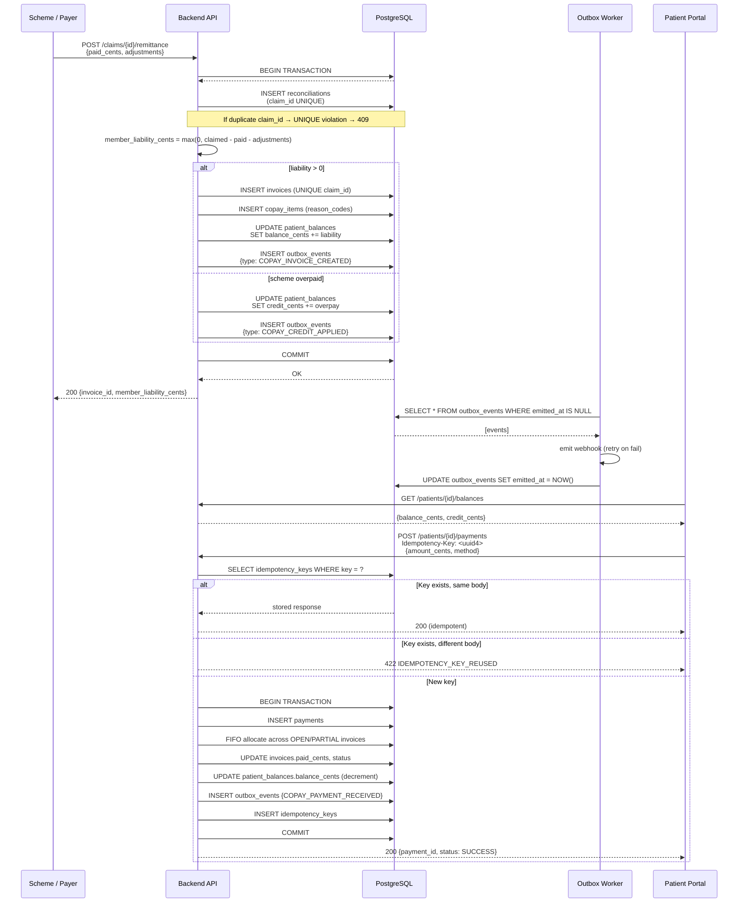

# Co-pay Flow — End-to-End Sequence (Appendix D)

## Mermaid Sequence Diagram

## Narrative

### Step 1: Remittance Received
The payer/scheme posts the remittance advice. `ReconciliationService.apply_remittance()` runs inside a single transaction. A `UNIQUE` constraint on `reconciliations.claim_id` prevents double-processing.

### Step 2: Liability Computed
`member_liability_cents = max(0, claimed_total_cents - paid_cents - adjustment_cents)`. Pure integer arithmetic — no floats.

### Step 3: Invoice Created (if liability > 0)
One `invoices` row per claim (enforced by `UNIQUE(invoices.claim_id)`). `copay_items` rows carry the reason codes (e.g. `TARIFF_DIFFERENCE`, `OUT_OF_NETWORK_SHORTFALL`). `patient_balances.balance_cents` is incremented atomically.

### Step 4: Outbox Event Emitted
An `outbox_events` row is written inside the same transaction. The worker picks it up asynchronously — webhook failures never roll back the invoice.

### Step 5: Patient Pays
`POST /patients/{id}/payments` requires an `Idempotency-Key` UUID. The service allocates payment FIFO across open invoices, updates invoice status (`PARTIAL` → `PAID`), decrements balance. Any overpayment becomes `credit_cents`. Repeated requests with the same key return the original response.

## Reversal
`ReconciliationService.reverse(claim_id)` voids the invoice, restores the balance, and emits `COPAY_INVOICE_VOIDED`. Payments already applied remain and become credit.
